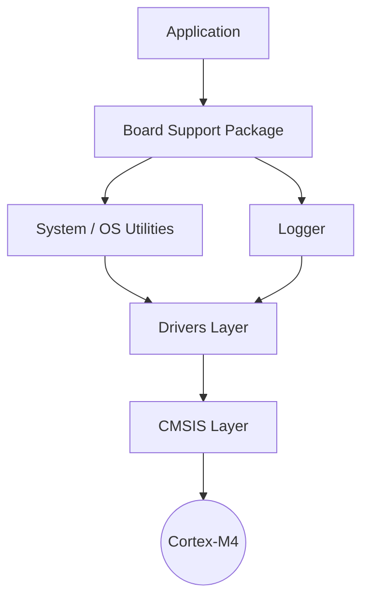
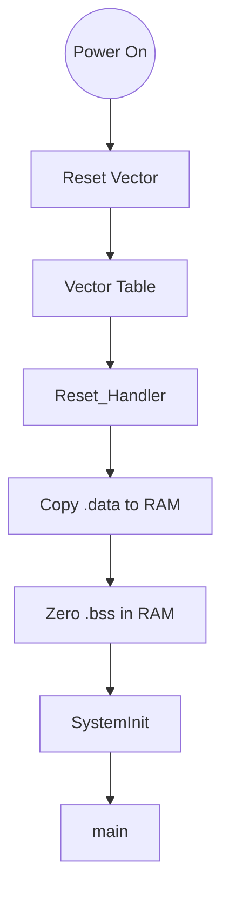
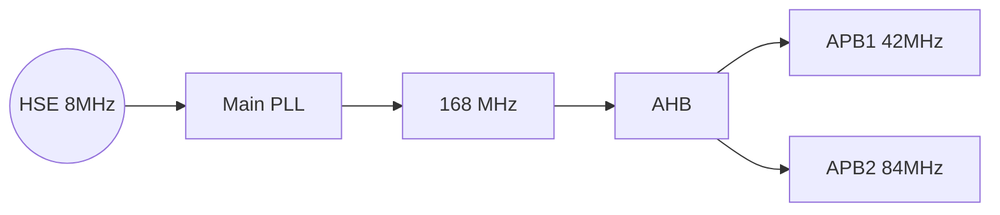
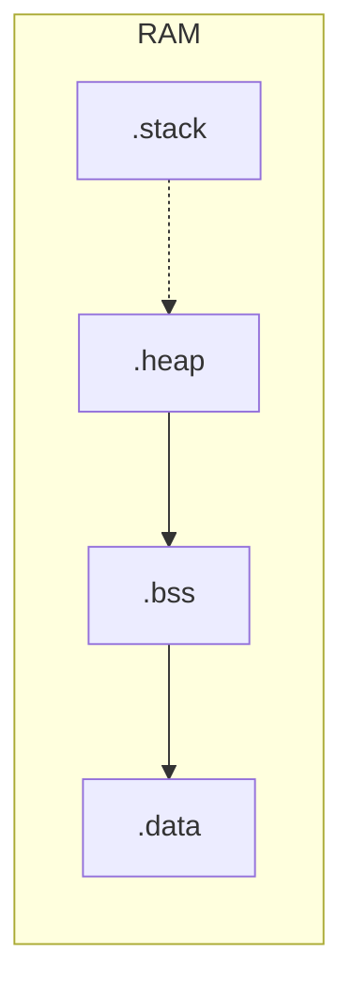
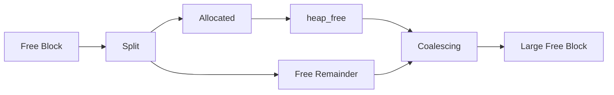
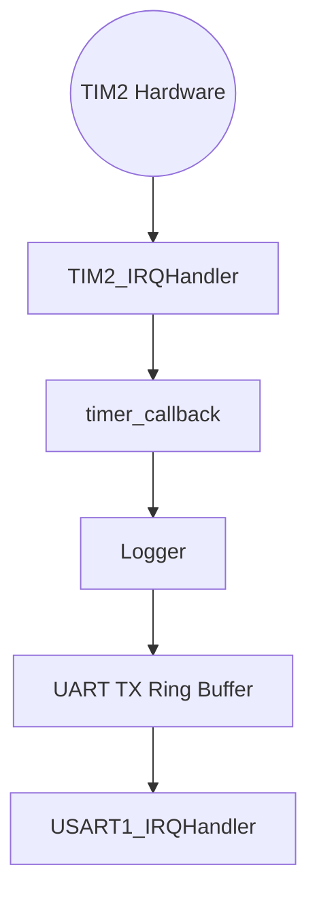

# Bare-Metal Firmware Platform

[](#)
[](#)
[](#)
[](#)

**STM32F405 • Cortex-M4 • QEMU • Register-Level Drivers • Interrupt-Driven BSP**

A production-grade, bare-metal firmware platform engineered from scratch for the ARM Cortex-M4 architecture. This repository is implemented without relying on vendor HAL libraries to demonstrate register-level understanding of the Cortex-M4 architecture, nested interrupts, linker scripts, circular buffers, and dynamic memory management.

---

## 🌟 Repository Highlights

- [x] **Custom Cortex-M4 startup** (Written in pure assembly)
- [x] **No STM32 HAL / No CubeMX** (Direct register manipulation)
- [x] **Custom linker script** (`.data` relocation, `.bss` zeroing, dynamic heap)
- [x] **Interrupt-driven architecture** (No busy-wait polling loops)
- [x] **First-fit allocator** (Deterministic custom `malloc`/`free` implementation)
- [x] **QEMU validated** (100% hardware-agnostic CI-ready emulation)

---

## 📂 Folder Structure

```text
bare-metal-firmware-platform/
├── app/            # Application entry point (main.c)
├── boot/           # ARM Assembly startup code and vector tables
├── bsp/            # Board Support Package (High-level initialization)
├── docs/           # Engineering documentation and design decisions
├── drivers/        # Register-level hardware drivers (UART, GPIO, Timer, etc.)
├── include/        # CMSIS register mappings and memory map definitions
├── lib/            # Agnostic software libraries (Ring Buffer, Logging)
├── linker/         # Custom linker script mapping Flash and RAM regions
├── system/         # Core OS-level utilities (Heap, Critical Sections, Callbacks)
└── tests/          # Subsystem validation procedures
```

---

## 📊 Development Status

- [x] **BSP Complete**
- [x] **Drivers Complete**
- [x] **Heap Complete**
- ▶️ **RTOS Integration Next** (In Progress)

---

## ⚙️ Features & Drivers

| Feature / Subsystem | Status | Description |
| ------------------- | ------ | ----------- |
| **Startup Code**    | ✅      | Pure ASM initialization, vector routing, and `.data`/`.bss` setup |
| **Linker Script**   | ✅      | Custom region mapping and stack/heap symbol exportation |
| **Clock Tree**      | ✅      | `HSE` to `PLL` 168MHz overdrive routing |
| **GPIO**            | ✅      | Atomic `BSRR` driven I/O and Alternate Function multiplexing |
| **UART**            | ✅      | Interrupt-driven UART with lock-free SPSC ring buffer |
| **SysTick**         | ✅      | Core timing mechanism and lowest-priority exception setup |
| **General Timer**   | ✅      | Call-back decoupled, interrupt-driven `TIM2` hardware scaling |
| **Heap Allocator**  | ✅      | First-fit allocator with forward coalescing |
| **Logger backend**  | ✅      | Asynchronous, decoupled logging routing to UART interrupts |

---

## 🏛️ System Architecture

Strict layer separation. High-level applications interact with the BSP and abstractions, leaving low-level drivers to negotiate with hardware registers safely.



---

## 🚀 Boot Flow

Custom Cortex-M4 startup sequence executing prior to the application layer.



---

## ⏱️ Clock Tree

Production-style clock tree utilizing the HSE (High-Speed External) oscillator and the Main PLL to achieve the 168 MHz performance ceiling.



---

## 🧠 Memory Layout

Memory layout is dynamically managed by the custom `stm32f405.ld` linker script. The stack grows downwards from the top of RAM, while the heap dynamically consumes all remaining space above the `.bss` section without arbitrary hardcoded boundaries.



---

## 💾 Heap Allocator

A deterministic **First-Fit** bare-metal memory allocator operating on an 8-byte aligned linked list. It features strict pointer validation and real-time block coalescing.



---

## ⏳ Timer Event Flow

Interrupt-driven timer implementation leveraging a `callback_t` decoupled software architecture.



---

## 📸 Validation & Screenshots

### QEMU Execution Trace
Fully deterministic emulation executing real ARM machine code:
```text
[INFO] Booting...
[INFO] Clock Initialized
[INFO] GPIO Initialized
[INFO] UART Initialized
[INFO] Interrupt-driven UART Active
[INFO] Heap Initialized
[INFO] Timer Initialized and Started (500ms)
[INFO] Alloc p1
[INFO] Alloc p2
[INFO] Freed p1
[INFO] Alloc p3
[INFO] Freed all
[INFO] Starting 1000-iteration heap stress test...
[INFO] Stress test PASSED: No fragmentation leak.
[INFO] System Idle...
[INFO] Timer Event
[INFO] Timer Event
```

### ELF Section Validation (objdump)
Verifying proper linker section mapping:
```text
$ arm-none-eabi-objdump -h build/firmware.elf

Sections:
Idx Name          Size      VMA       LMA       File off  Algn
  0 .text         00001a40  08000000  08000000  00010000  2**2
  1 .data         00000014  20000000  08001a40  00020000  2**2
  2 .bss          00000808  20000014  20000014  00020014  2**2
  3 .heap         0001eff0  20000820  20000820  00020820  2**3
  4 .stack        00001000  2001f810  2001f810  0003f810  2**3
```

### Memory Poisoning (GDB)
GDB memory inspection validating deterministic heap poisoning. Fresh allocations are painted `0xCD`, while freed memory is scrubbed with `0xEF` to easily identify use-after-free conditions.
```text
(gdb) x/16bx 0x20000830
0x20000830:  0xcd 0xcd 0xcd 0xcd 0xcd 0xcd 0xcd 0xcd
0x20000838:  0xcd 0xcd 0xcd 0xcd 0xcd 0xcd 0xcd 0xcd
(gdb) c
Continuing.
(gdb) x/16bx 0x20000830
0x20000830:  0xef 0xef 0xef 0xef 0xef 0xef 0xef 0xef
0x20000838:  0xef 0xef 0xef 0xef 0xef 0xef 0xef 0xef
```

---

## 📈 Benchmarks

| Subsystem | Metric | Result |
| :--- | :--- | :--- |
| **Heap Allocator** | 1,000 Iterations of Random Interlaced Sizes | **Passed** (0 leaked bytes) |
| **UART Throughput** | 30,000 Byte Asynchronous Burst Transfer | **Passed** (0 dropped, 0 overflows) |
| **Hardware Timer** | `TIM2` 500 ms Periodic Expiration Event | **Stable** (100% callback rate) |

---

## 🛠️ Build Instructions

The toolchain requires `arm-none-eabi-gcc` and QEMU's `netduinoplus2` board emulation.

```bash
# Build the ELF firmware binary
make

# Launch firmware interactively on QEMU
make run_qemu

# Clean build artifacts
make clean
```

---

## 🛡️ Debug Features

The platform leverages advanced, OS-level debugging tactics without the overhead of an RTOS:

- **Memory Poisoning**: Fresh allocations are painted with `0xCD`. Freed blocks are scrubbed with `0xEF`. This allows developers to trivially catch use-after-free bugs in GDB.
- **Nested Critical Sections**: Using a `PRIMASK` nesting counter ensures concurrent ring buffer interactions between thread-mode and Handler-mode never deadlock or accidentally re-enable interrupts prematurely.
- **Interrupt Vector Alignment**: Complete manual alignment of the vector table using `.space` paddings guarantees no hard faults via pointer misalignment.

---

## 💬 Engineering Q&A

**Why write a custom linker script instead of using STM32Cube IDE's generator?**
By controlling the linker, we can precisely dictate memory regions like `_heap_start` and `_heap_end`, ensuring our custom memory allocator dynamically fills available RAM without arbitrary `#define` limits.

**Why use `BSRR` (Bit Set/Reset Register) over `ODR` (Output Data Register)?**
`BSRR` allows atomic GPIO manipulation. Modifying `ODR` involves a read-modify-write operation which can suffer from race conditions if an interrupt preempts the CPU between the read and write phases.

**Why disable the `TXE` (Transmit Empty) interrupt?**
Leaving `TXE` enabled while the ring buffer is empty results in an infinite "interrupt storm" where the CPU is continuously pulled into the ISR. We dynamically toggle `TXEIE` to match the ring buffer state.

**Why First-Fit for the Heap?**
First-Fit is highly deterministic, fast, and sufficiently resists fragmentation when coupled with forward coalescing. While TLSF (Two-Level Segregated Fit) offers O(1) performance, First-Fit achieves the perfect balance of implementation simplicity and embedded performance.

**Why strict 8-byte alignment?**
The ARM Architecture Procedure Call Standard (AAPCS) demands 8-byte alignment to safely access 64-bit primitives (`double`, `long long`). Breaking this causes immediate `UsageFault` traps.

**Why use a decoupled callback architecture for Timers?**
Putting application logic inside `TIM2_IRQHandler` violates Layering and Dependency Inversion. The hardware driver simply triggers a `callback_t`, allowing the Application layer to dictate what happens when the timeout expires.
