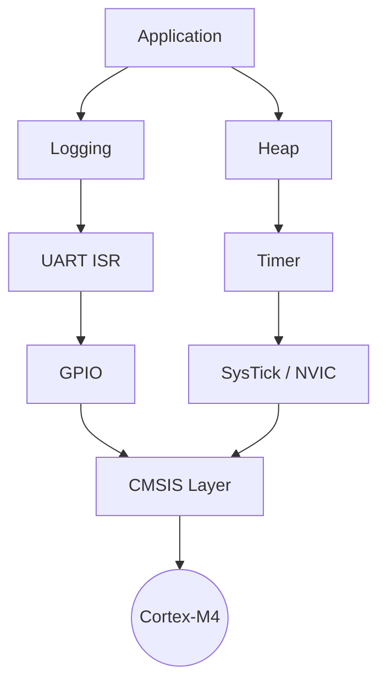
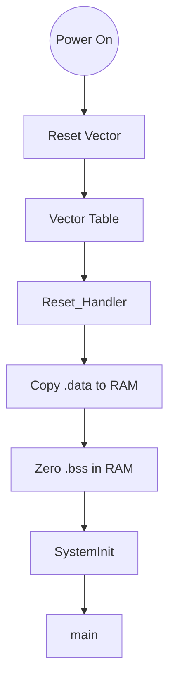
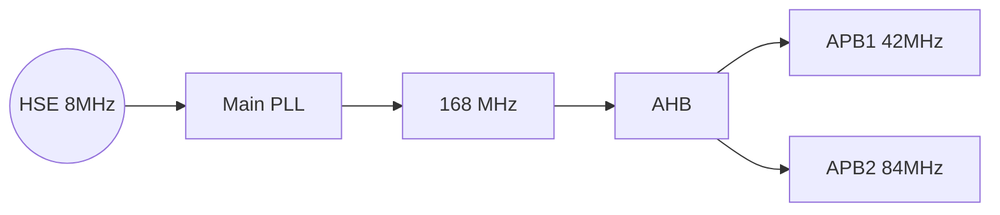
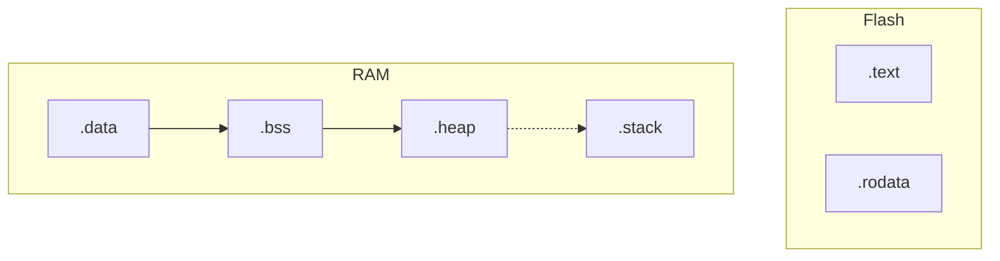
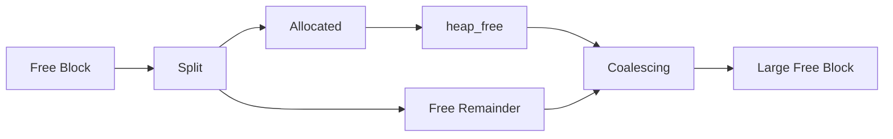
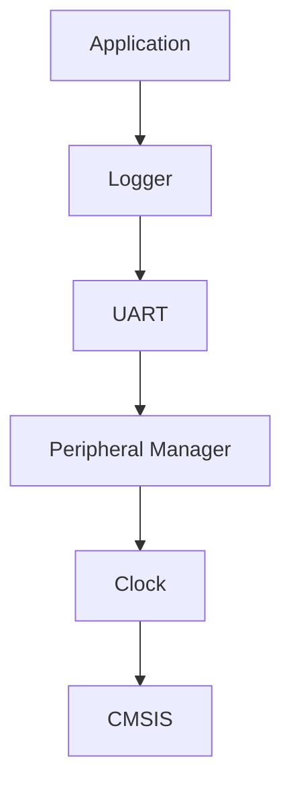
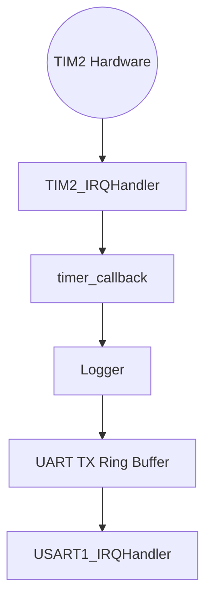

# Bare-Metal Firmware Platform

**STM32F405 • Cortex-M4 • QEMU • Register-Level Drivers • Interrupt-Driven BSP**

A production-grade, bare-metal firmware platform engineered from scratch for the ARM Cortex-M4 architecture. This repository skips the typical vendor HAL layers (STM32Cube, SPL) to demonstrate a deep understanding of microcontroller architecture, nested interrupts, linker scripts, circular buffers, and memory management.

---

## 🏛️ Hero Architecture



---

## ⚙️ Features

| Feature        | Status |
| -------------- | ------ |
| Startup        | ✅      |
| Linker         | ✅      |
| Clock Tree     | ✅      |
| GPIO           | ✅      |
| UART           | ✅      |
| Interrupt UART | ✅      |
| Logging        | ✅      |
| Timer          | ✅      |
| Heap           | ✅      |

---

## 🚀 Boot Flow

Custom Cortex-M4 startup written in pure assembly, bypassing bloated vendor initializations.



---

## ⏱️ Clock Tree

Production-style clock tree configuration utilizing the HSE (High-Speed External) oscillator and the Main PLL to achieve maximum Cortex-M4 performance.



---

## 🧠 Memory Layout

Memory layout is dynamically managed by the custom `stm32f405.ld` linker script. The heap dynamically scales to fill the void between `.bss` and the Stack.



---

## 💾 Heap Allocator

A deterministic **First-Fit** bare-metal memory allocator operating on an 8-byte aligned, embedded linked list. It features strict pointer validation and real-time block coalescing.



---

## 📦 Driver Dependency Graph

Strict layer separation. High-level modules interact with abstractions, leaving low-level drivers to negotiate with hardware registers.



---

## ⏳ Timer Event Flow

Completely interrupt-driven timer implementation leveraging a `callback_t` decoupled software architecture.



---

## 💻 QEMU Console Execution

Fully deterministic QEMU validation running at bare-metal speed:

```text
[INFO] Booting...
[INFO] Clock Initialized
[INFO] GPIO Initialized
[INFO] UART Initialized
[INFO] Interrupt-driven UART Active
[INFO] Heap Initialized
[INFO] Timer Initialized and Started (500ms)
[INFO] Alloc p1
[INFO] Alloc p2
[INFO] Freed p1
[INFO] Alloc p3
[INFO] Freed all
[INFO] Starting 1000-iteration heap stress test...
[INFO] Stress test PASSED: No fragmentation leak.
[INFO] System Idle...
[INFO] Timer Event
[INFO] Timer Event
[INFO] Timer Event
```

---

## 🛠️ Build Instructions

The toolchain utilizes `arm-none-eabi-gcc` and QEMU's `netduinoplus2` board emulation.

```bash
# Build the ELF firmware binary
make

# Launch firmware interactively on QEMU
make run_qemu

# Clean build artifacts
make clean
```

---

## 📊 Benchmarks

| Subsystem | Metric | Result |
| :--- | :--- | :--- |
| **Heap Allocator** | 1000 Random Interlaced Tests | Passed |
| **Interrupt UART** | 30,000 Continuous Bytes | Passed |
| **Hardware Timer** | 500 ms Periodic Expiration | Stable |

---

## 🛡️ Debug Features

The platform leverages advanced, OS-level debugging tactics without the overhead of an RTOS:

- **Memory Poisoning**: Fresh allocations are painted with `0xCD`. Freed blocks are scrubbed with `0xEF`. This allows developers to trivially catch use-after-free bugs in GDB.
- **Nested Critical Sections**: Using a `PRIMASK` nesting counter ensures concurrent ring buffer interactions between thread-mode and Handler-mode never deadlock or accidentally re-enable interrupts prematurely.
- **Interrupt Vector Alignment**: Complete manual alignment of the vector table using `.space` paddings guarantees no hard faults via pointer misalignment.

---

## 📈 Project Statistics

- **Modules:** 10+
- **Drivers:** 6
- **Interrupts Managed:** 3 (SysTick, USART1, TIM2)
- **Memory Allocator:** First-Fit linked list
- **Testing Platform:** QEMU (netduinoplus2) / STM32F405

---

## 💬 Engineering Q&A

**Why write a custom linker script instead of using STM32Cube IDE's generator?**
By controlling the linker, we can precisely dictate memory regions like `_heap_start` and `_heap_end`, ensuring our custom memory allocator dynamically fills available RAM without arbitrary `#define` limits.

**Why use `BSRR` (Bit Set/Reset Register) over `ODR` (Output Data Register)?**
`BSRR` allows atomic GPIO manipulation. Modifying `ODR` involves a read-modify-write operation which can suffer from race conditions if an interrupt preempts the CPU between the read and write phases.

**Why disable the `TXE` (Transmit Empty) interrupt?**
Leaving `TXE` enabled while the ring buffer is empty results in an infinite "interrupt storm" where the CPU is continuously pulled into the ISR. We dynamically toggle `TXEIE` to match the ring buffer state.

**Why First-Fit for the Heap?**
First-Fit is highly deterministic, fast, and sufficiently resists fragmentation when coupled with forward coalescing. While TLSF (Two-Level Segregated Fit) offers O(1) performance, First-Fit achieves the perfect balance of implementation simplicity and embedded performance.

**Why strict 8-byte alignment?**
The ARM Architecture Procedure Call Standard (AAPCS) demands 8-byte alignment to safely access 64-bit primitives (`double`, `long long`). Breaking this causes immediate `UsageFault` traps.

**Why use a decoupled callback architecture for Timers?**
Putting application logic inside `TIM2_IRQHandler` violates Layering and Dependency Inversion. The hardware driver simply triggers a `callback_t`, allowing the Application layer to dictate what happens when the timeout expires.
